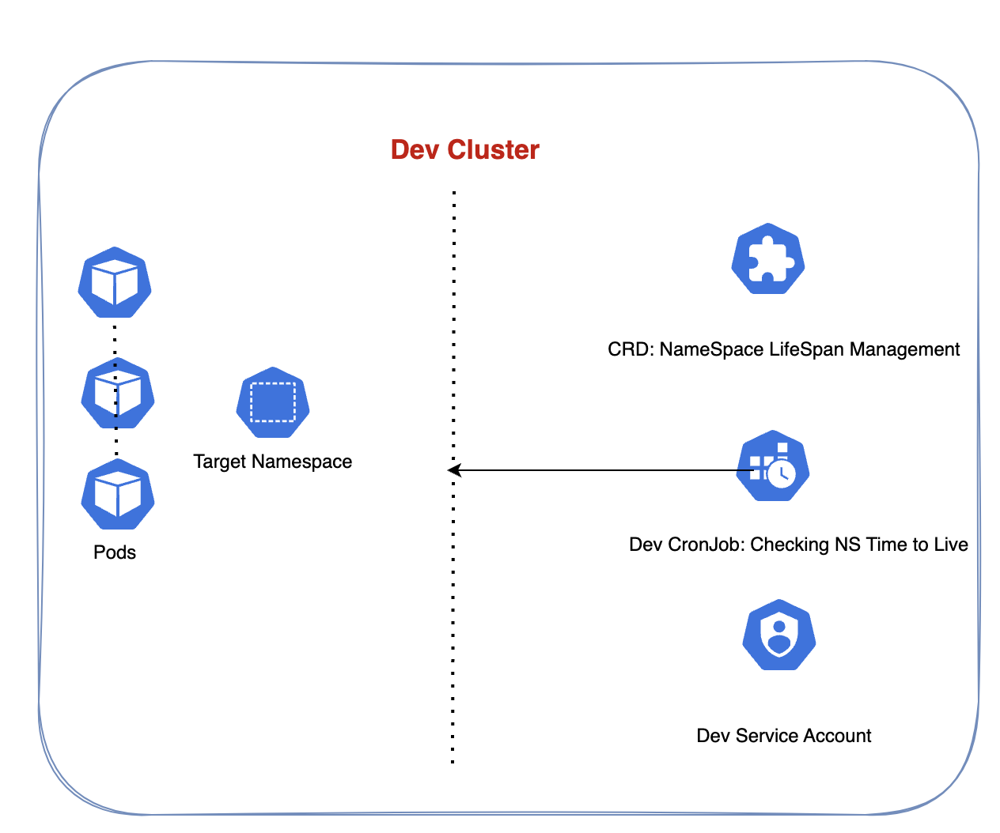

# kubeshorty

`kubeshorty` is a Kubernetes CronJob designed to help maintain ephemeral environments by automatically cleaning up unused namespaces (NS) in your cluster. The CronJob checks for namespaces with the label `env=dev` and performs two actions:

- **Deletes namespaces** that are older than **5 days**.
- Sends a **warning message to a Slack channel** for namespaces that are **older than 4 days**.

This helps to ensure that unnecessary resources from expired or stale environments do not incur extra costs, particularly in development environments where namespaces may be spun up temporarily and left behind.

## Features:
- **Namespace Cleanup:** Automatically deletes `env=dev` namespaces older than 5 days.
- **Slack Notifications:** Sends a warning to a Slack channel for namespaces older than 4 days to alert the team.
- **Cost Management:** Prevents unwanted resource usage in Kubernetes clusters, helping to manage and optimize development infrastructure costs.

## Prerequisites:
- Kubernetes cluster with namespaces labeled `env=dev`.
- Slack webhook integration for sending notifications.
- CronJob permissions set up for managing namespaces.

## Setup Instructions:

### 1. Deploy the CronJob

You can deploy `kubeshorty` in your Kubernetes cluster by applying the following YAML files:

```bash
kubectl apply -f kubeshorty-cronjob.yaml
```

This will set up the CronJob to run at your specified interval.



### 2. Configure Slack Integration

To send notifications to Slack, create a Slack Incoming Webhook URL. Once you have your webhook URL, update the CronJob configuration with the Slack URL:

```yaml
SLACK_WEBHOOK_URL: "https://hooks.slack.com/services/your/webhook/url"
```

### 3. Adjust Namespace Labeling

Ensure that namespaces you want to be managed are properly labeled with `env=dev`:

```bash
kubectl label namespace <namespace-name> env=dev
```

### 4. Review CronJob Schedule

The default schedule for this CronJob is set to run daily. You can modify the schedule in the CronJob YAML (`kubeshorty-cronjob.yaml`) according to your needs.

```yaml
schedule: "0 0 * * *" # Adjust this as needed
```

### 5. Monitor and Review

Check the logs of the CronJob to ensure that it is running properly:

```bash
kubectl logs -l job-name=kubeshorty-cronjob
```

## Notes:
- The CronJob will not delete namespaces with running workloads. Make sure that namespaces to be deleted are free of critical workloads or resources.
- Adjust the days threshold (4 and 5 days) according to your organization’s environment and requirements.

